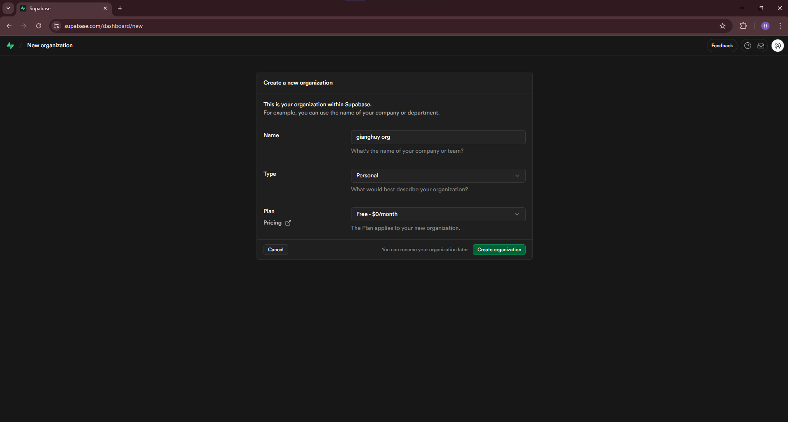
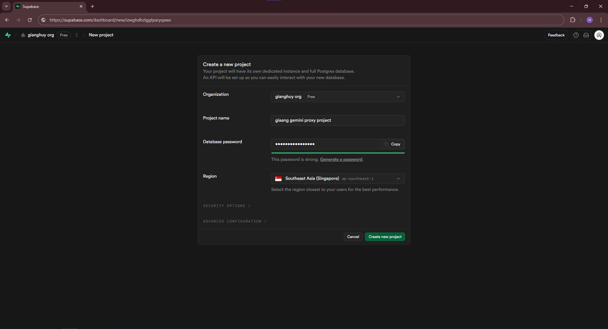
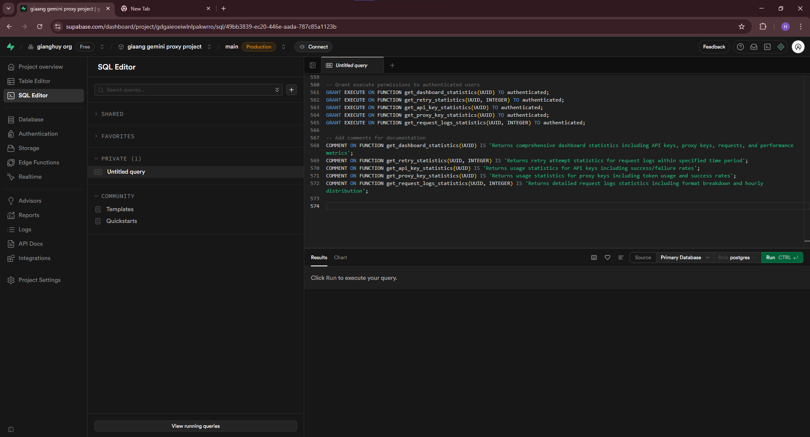
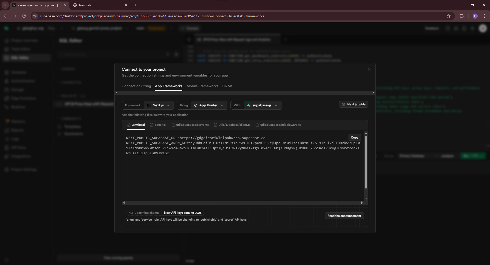
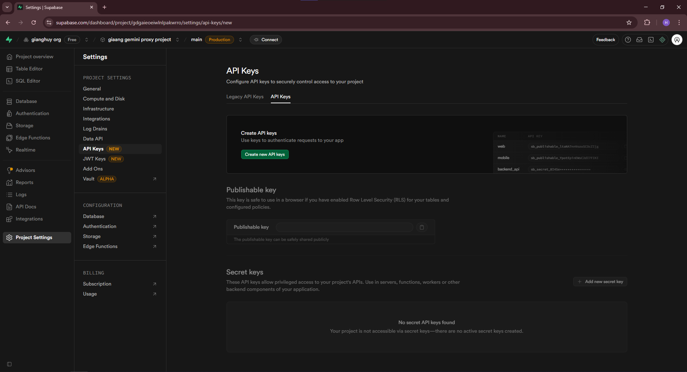

# 🧭 Getting Started (Supabase + Schema + Env)

Follow these steps to set up Supabase, initialize the database schema, and save environment variables for your chosen platform.

## 1. Create a Supabase account

- Go to [`https://supabase.com`](https://supabase.com) and sign up.

## 2. Create a Supabase organization

- In the Supabase dashboard, click “New organization”, enter a name, then continue.



## 3. Create a Supabase project

- Select your organization, click “New project”.
- Choose a name, a strong database password (copy and store it in a safe place), and a region.
- Click “Create project” and wait for provisioning to finish.



## 4. Initialize the database schema

- Open Supabase Dashboard → your project → SQL → SQL Editor.
- Open [schema.sql](https://github.com/lehuygiang28/gemini-proxy/blob/main/packages/database/sql/schema.sql) and copy all of its contents.
- Paste into the SQL Editor and run it.



This creates the required tables, indexes, and RPC functions (`api_keys`, `proxy_api_keys`, `request_logs`, and statistics functions).

## 5. Get connection and API info (save it)

- Supabase Dashboard → Project Settings → API:
  - Copy `Project URL` (REST URL)
  - Copy `Service role` key (keep it secret)
- Supabase Dashboard → Project Settings → Database:
  - Keep your database password you created in step 3 saved securely

Save these for later use:

- SUPABASE_URL = Project URL
- SUPABASE_SERVICE_ROLE_KEY = Service role key
- (DB password kept safe; not directly needed for this project’s envs)



### 5.1 Create a Service Role key (if you don’t have one)

- Supabase Dashboard → Project Settings → API Keys → API Keys.
- Click “Create new keys”.
- Name it and ensure scope/role is set appropriately for Service Role.
- Save the generated key securely; you will use it as `SUPABASE_SERVICE_ROLE_KEY`.



## 6. Add environment variables by platform

- Next.js Web (apps/web): create `.env.development` and set:

```bash
NEXT_PUBLIC_SUPABASE_URL="<your-supabase-url>"
NEXT_PUBLIC_ANON_SUPABASE_KEY="<your-anon-key>"
SUPABASE_SERVICE_ROLE_KEY="<your-service-role-key>"
```

- Standalone API (apps/api): create `.env` and set:

```bash
SUPABASE_URL="<your-supabase-url>"
SUPABASE_SERVICE_ROLE_KEY="<your-service-role-key>"
```

- Vercel Edge (packages/vercel): set project env vars in Vercel dashboard:

```bash
SUPABASE_URL
SUPABASE_SERVICE_ROLE_KEY
```

- Cloudflare Worker (packages/cloudflare): set secrets via Wrangler:

```bash
wrangler secret put SUPABASE_URL
wrangler secret put SUPABASE_SERVICE_ROLE_KEY
```

- Appwrite Function (packages/appwrite): create variables via Appwrite CLI or Console:

```bash
SUPABASE_URL
SUPABASE_SERVICE_ROLE_KEY
```

Optional configs live in root `README.md` under “Environment Variables”.

## 7. Run locally

```bash
pnpm install
pnpm dev
```

You’re ready to use the proxy endpoints and the dashboard.
