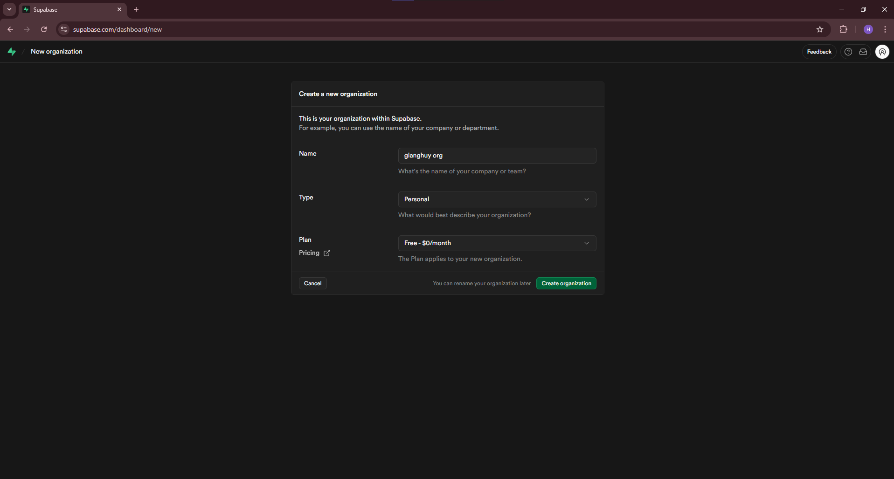
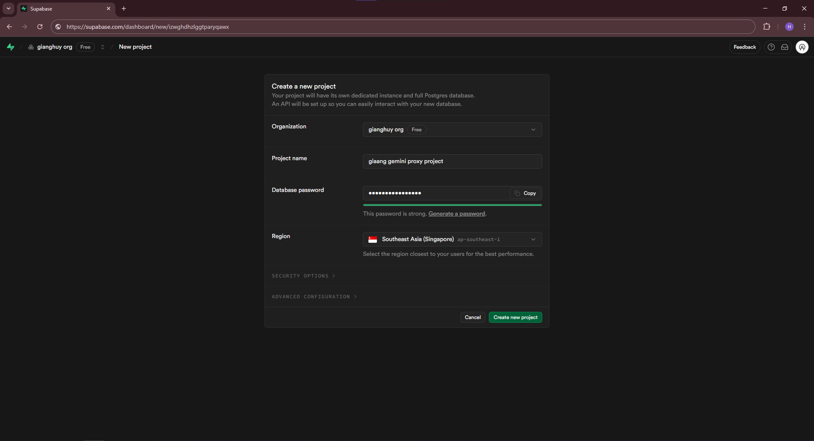
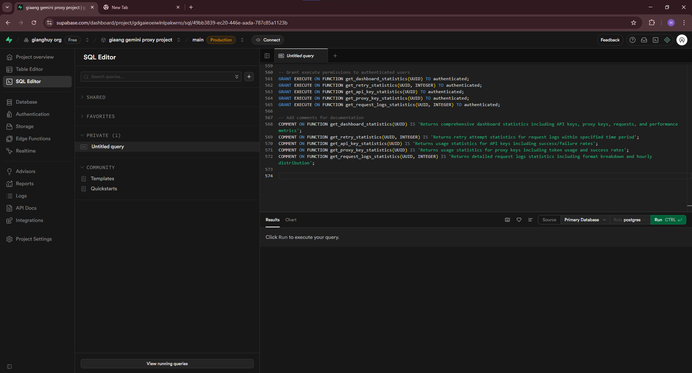
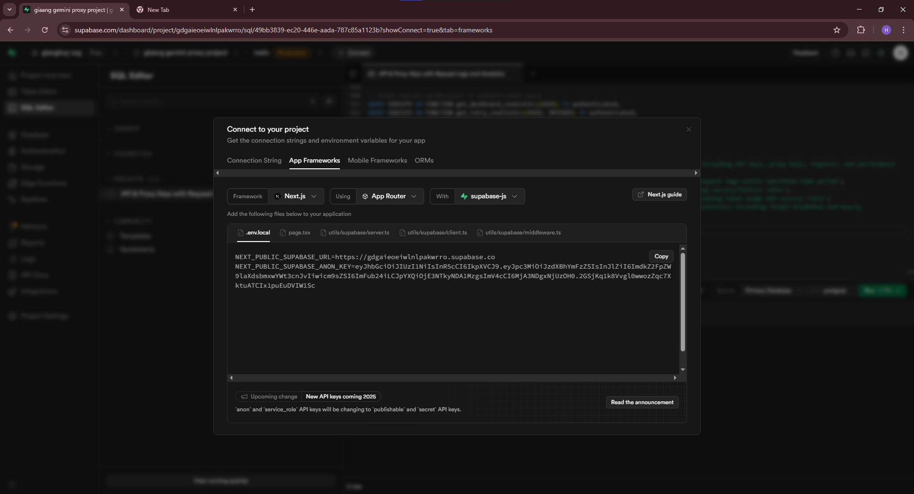
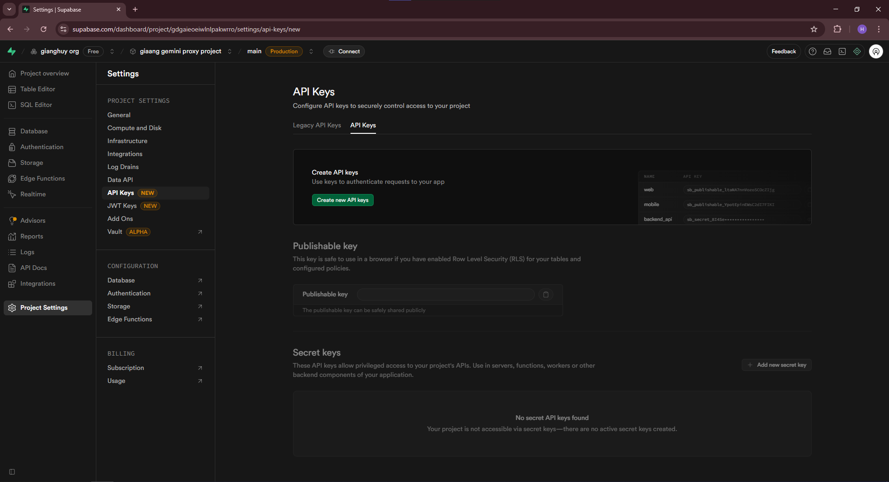

# 🧭 Getting Started (Supabase + Schema + Env)

Follow these steps to set up Supabase, initialize the database schema, and save environment variables for your chosen platform.

## Fast Supabase setup (for Cloudflare / local)

Cloudflare **does not** auto-provision Supabase (unlike the [Vercel Deploy button](../README.md#one-click-deploy-production) with Supabase integration). Do this once (~60 seconds):

1. [Create a Supabase project](https://supabase.com/dashboard/new/project)
2. **SQL Editor** → paste and run [`packages/database/sql/schema.sql`](../packages/database/sql/schema.sql) (or use `pnpm db:apply` from step 4 below)
3. **Settings → API** → copy **Project URL**, **anon** key (`sb_publishable_...`), and **service role** key (`sb_secret_...`)
4. Paste into the Cloudflare Deploy form (see [`.dev.vars.example`](../.dev.vars.example)) or into `apps/web/.env.local` for local dev
5. **Authentication → URL Configuration** (after Cloudflare deploy):
   - **Site URL:** `https://<your-worker>.workers.dev`
   - **Redirect URLs:** add `https://<your-worker>.workers.dev/**`

Without step 5, login and OAuth callbacks will fail on Cloudflare.

**Fastest path with auto-migrations:** use the Vercel button in the [root README](../README.md#one-click-deploy-production) — it runs [`supabase/migrations/`](../supabase/migrations/) for you.

## 1. Create a Supabase account

- Go to [`https://supabase.com`](https://supabase.com) and sign up.

## 2. Create a Supabase organization

- In the Supabase dashboard, click “New organization”, enter a name, then continue.



## 3. Create a Supabase project

- Select your organization, click “New project”.
- Choose a name, a strong database password (copy and store it in a safe place), and a region.
- Click “Create project” and wait for provisioning to finish.



## 4. Initialize the database schema

From the repo root (after `pnpm install`):

```bash
cp packages/database/.env.example packages/database/.env
# Edit packages/database/.env — set SUPABASE_DB_URL (Session pooler URI from Dashboard → Connect)
pnpm db:apply
```

This runs `supabase db push` and applies all versioned migrations in [`supabase/migrations/`](../supabase/migrations/).

**Fallback (SQL Editor):** paste [`packages/database/sql/schema.sql`](../packages/database/sql/schema.sql) into Supabase Dashboard → SQL → SQL Editor and run it. Use this only if you cannot run the CLI. For existing databases created from an older `schema.sql`, prefer `pnpm db:apply` so incremental migrations apply safely.



This creates the required tables, indexes, and RPC functions (`api_keys`, `proxy_api_keys`, `request_logs`, `user_settings`, and statistics functions).

## 5. Get connection and API info (save it)

- Supabase Dashboard → Project Settings → API:
  - Copy `Project URL` (REST URL)
  - Copy `Service role` key (keep it secret)
- Supabase Dashboard → Project Settings → Database:
  - Keep your database password you created in step 3 saved securely

Save these for later use:

- SUPABASE_URL = Project URL
- SUPABASE_SERVICE_ROLE_KEY = Service role key
- SUPABASE_DB_URL = Session pooler URI (only needed for `pnpm db:apply`, not daily `pnpm dev`)



### 5.1 Create a Service Role key (if you don’t have one)

- Supabase Dashboard → Project Settings → API Keys → API Keys.
- Click “Create new keys”.
- Name it and ensure scope/role is set appropriately for Service Role.
- Save the generated key securely; you will use it as `SUPABASE_SERVICE_ROLE_KEY`.



## 6. Add environment variables by platform

- Next.js Web (apps/web): create `.env.development` and set:

```bash
NEXT_PUBLIC_SUPABASE_URL="<your-supabase-url>"
NEXT_PUBLIC_ANON_SUPABASE_KEY="<your-anon-key>"
SUPABASE_SERVICE_ROLE_KEY="<your-service-role-key>"
```

- Standalone API (apps/api): create `.env` and set:

```bash
SUPABASE_URL="<your-supabase-url>"
SUPABASE_SERVICE_ROLE_KEY="<your-service-role-key>"
```

- Vercel Edge (packages/vercel): set project env vars in Vercel dashboard:

```bash
SUPABASE_URL
SUPABASE_SERVICE_ROLE_KEY
```

- Cloudflare full-stack (OpenNext, default): set variables/secrets on Worker `gemini-proxy-web` (Deploy button or dashboard). Copy [`.dev.vars.example`](../.dev.vars.example). CLI:

```bash
wrangler secret put SUPABASE_URL --config wrangler.jsonc
wrangler secret put SUPABASE_SERVICE_ROLE_KEY --config wrangler.jsonc
```

- Cloudflare API-only (`packages/cloudflare`): set secrets via Wrangler:

```bash
wrangler secret put SUPABASE_URL --config packages/cloudflare/wrangler.jsonc
wrangler secret put SUPABASE_SERVICE_ROLE_KEY --config packages/cloudflare/wrangler.jsonc
```

- Appwrite Function (packages/appwrite): create variables via Appwrite CLI or Console:

```bash
SUPABASE_URL
SUPABASE_SERVICE_ROLE_KEY
```

Optional configs live in root `README.md` under “Environment Variables”.

## 7. Run locally

```bash
pnpm install
pnpm dev
```

When you pull new database changes from git, run `pnpm db:apply` once to apply pending migrations.

Optional (contributors): local Supabase with Docker — `pnpm db:start`, then `pnpm db:reset` to replay migrations locally. See [Supabase CI & migrations](./supabase-ci.md).

You’re ready to use the proxy endpoints and the dashboard.
